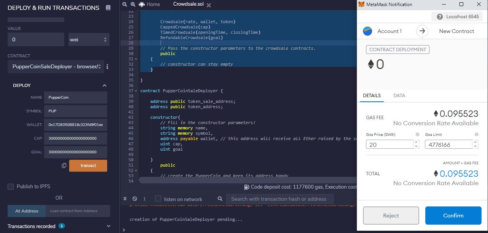

# Crowdsale with Solidity

*Source: https://cointelegraph.com/*

## Background

A new startup has decided to crowdsale their PupperCoin token in order to help fund the network development.This network will be used to track dog breeding activity across the globe in a decentralized way, and allow humans to track the genetic trail of their pets. They have already worked with the necessary legal bodies and obtained the green light on creating a crowdsale open to the public. However, the company is required to enable refunds if the crowdsale is successful and the goal is met, and are only allowed to raise a maximum of 300 ether. The crowdsale will run for 24 weeks.

We will need to create an ERC20 token that will be minted through a `Crowdsale` contract that will leverage the OpenZeppelin Solidity library.

This crowdsale contract will manage the entire process, allowing users to send ETH and get back PUP (PupperCoin).
This contract will mint the tokens automatically and distribute them to buyers in one transaction.

It will need to inherit `Crowdsale`, `CappedCrowdsale`, `TimedCrowdsale`, `RefundableCrowdsale`, and `MintedCrowdsale` from OpenZeppelin Solidity library.

The crowdsale will be conducted on the Kovan testnet in order to get a real-world pre-production test in.

## Creating the project

Using Remix, a contract called `PupperCoin` is created to generate a standard `ERC20Mintable` token. 

A new contract named `PupperCoinsale` is created and prepared like a standard crowdsale.

### Designing the contracts

#### ERC20 PupperCoin

A standard `ERC20Mintable` and `ERC20Detailed` contract is used, hardcoding `18` as the `decimals` parameter, and leaving the `initial_supply` parameter alone.

We don't need to hardcode the decimals; however, since most use-cases match Ethereum's default, we did it.

#### PupperCoinSale

First, at the top of the contract, you will need to import `PupperCoin.sol` the PupperCoin contract.

The `PupperCoinSale` contract is built using the following contracts from the  OpenZeppelin library:

* `Crowdsale`

* `MintedCrowdsale`

* `CappedCrowdsale`

* `TimedCrowdsale`

* `RefundablePostDeliveryCrowdsale`

Parameters for all of the features of the crowdsale, such as the `name`, `symbol`, `wallet` for fundraising, `cap`, `goal`, etc are defined in the constructor. 

We will then pass the parameters to the crowdsale contracts.

The `rate` is hardcoded to 1, to maintain parity with ether units (1 TKN per Ether, or 1 TKNbit per wei). Essentially, a token (TKN) can be divided into TKNbits just like ether can be divided into wei. When using a `rate` of 1, just like 1000000000000000000 wei is equal to 1 ether, 1000000000000000000 TKNbits is equal to 1 TKN.

Since `RefundablePostDeliveryCrowdsale` inherits the `RefundableCrowdsale` contract, which requires a `goal` parameter, we must call the `RefundableCrowdsale` constructor from the `PupperCoinsale` constructor, as well as the others. `RefundablePostDeliveryCrowdsale` does not have its own constructor, so just use the `RefundableCrowdsale` constructor that it inherits.

If you forget to call the `RefundableCrowdsale` constructor, the `RefundablePostDeliveryCrowdsale` will fail since it relies on it (it inherits from `RefundableCrowdsale`), and does not have its own constructor.

Pass the `open` and `close` times, using `now` and `now + 24 weeks` to set the times in the `PupperCoinSaleDeployer` contract.

#### PupperCoinSaleDeployer

Before starting this contract, we will define the following variables to store the addresses of the `PupperCoin` and `PupperCoinSale` contracts that this contract will be deploying:

  * An `address public` called `token_sale_address`, which will store `PupperCoinSale`'s address once deployed.

  * An `address public` called `token_address`, which will store `PupperCoin`'s address once deployed.

Inside of the constructor of this contract, perform the following:

Create the `PupperCoin` by defining a variable like `PupperCoin token` and setting it to equal `new PupperCoin()`. Inside of the parameters of `new PupperCoin`, pass in the `name` and `symbol` variables. For the `initial_supply` variable that `PupperCoin` expects, pass in `0`.

Then, store the address of the token by using `token_address = address(token)`. This will allow us to easily fetch the token's address for later from the deploying contract.

Next, create the `PupperCoinSale` contract using the same logic used when creating `PupperCoin`. Store the variable in `PupperCoinSale token_sale` and set the parameters:

  * `rate` should be hard-coded to `1` in order to maintain the same units as Ether.

  * `wallet` should be passed in from the main constructor, this is the wallet that will get paid all Ether raised by the `PupperCoinSale`.

  * `token` should be the actual `token` variable where `PupperCoin` is stored.

  * `cap` will be maximum of 300 ether that the contract will raise

  * `openingTime` is hard-coded to `now` and `closingTime is hard-coded to `now + 24 weeks`.

  * `goal` is defined same as the `cap` i.e. 300 ether

Once again, store the address of the `PupperCoinSale` in the `token_sale_address` variable for easy access later.

Finally, we need to set the `PupperCoinSale` contract as a `minter`, then renounce "mintership" from the `PupperCoinSaleDeployer` contract.  

We need to do this because when we set our token as `ERC20Mintable`, the `msg.sender` (the person/contract deploying) is automatically set as the default minter. Since `PupperCoinSaleDeployer` is actually `msg.sender` in this case, this step will ensure that the `PupperCoinSale` is the actual minter, as expected.

### Deploying the contracts

To deploy and test the contract we will need to load the `PupperCoinSale` and `PupperCoin` contracts via their deployed address using the `At Address` feature in the `Deploy` tab of Remix.

Contract Deployed in Local net:

Deploying `PupperCoinSale` and `PupperCoin` contracts in Local net:

Contract Deployed in Kovan Testnet:

### Testing the Crowdsale

The crowdsale is tested by sending ether to the crowdsale from a different account (**not** the same account that is raising funds) in the local network. 

Transaction Test in Local net:

Transaction Successful:

Once successful in local net we can then switch Metamask to Kovan testnet and purchase tokens, once confirmed, try to add the token to MyCrypto to see the balance. 

Transaction in Kovan testnet:

Transaction Success in Kovan:

Transaction details in Etherscan:

Custom token balance in MyCrypto after a few transactions from the `Add custom token` feature:

